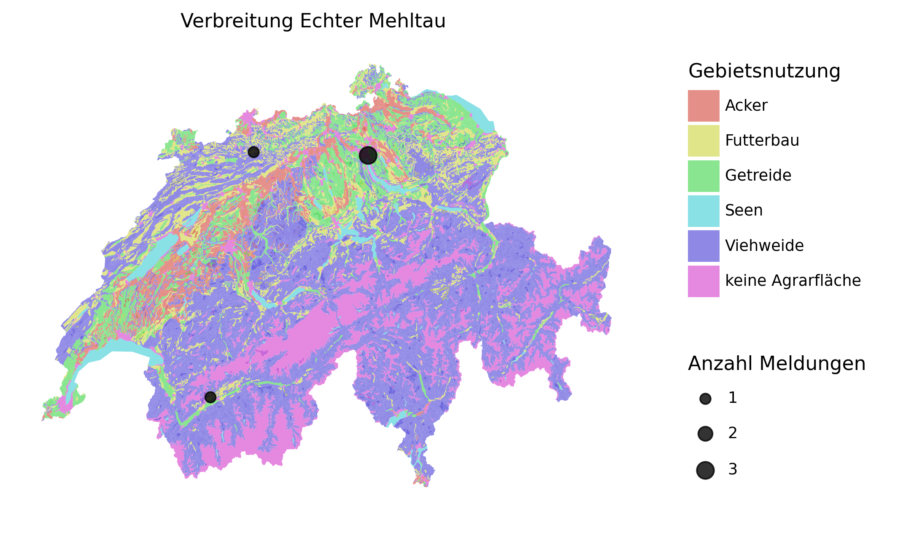

# Open Farming Hackdays: Open Data Farming

Farming is one of the oldest professions. Due to the extensive development of information technology, agriculture is facing yet another significant change after the industrial revolution. For farmers, there is a myriad of challenges to cope with, yet also as many opportunities. This premise was the point of reference for the first Swiss farming hackathon in 2020, called [Open Farming Hackdays](https://opendata.ch/projects/open-farming-hackdays-2020/).

Much hope lies in data-driven analyses. Data is valuable as everyone knows. As the wisdom goes, the more the data, the better. In many areas, however, there is no systematic data available. Thus, the main challenge is to collect data first before harvesting it for new insights. Unfortunately, much data is proprietary, meaning not free to use for everyone interested in it. Only open data enables innovation as any actors can make use of it by developing a multitude of solutions.

In farming, crowdsourced data about the spread of plant diseases or neophytes' prevalence could broadly foster new sustainable practices in the longer term. Against this backdrop, we developed an end-to-end prototype featuring the following:

* a **mobile web application** to record geo-referenced data on the field
* a **cloud-based web service** to aggregate the data at a central place
* a Python script to **access, combine, and plot this data with any other data source** of interest

## Framework

We use the [KoBoToolbox](https://www.kobotoolbox.org/) to build the mobile web application and store the data on their server, which are free to use. KoBoToolbox provides a powerful API, allowing for quick prototyping. As KoBoToolbox is itself an open-source framework, the presented application can be easily migrated to private servers [using Docker images](https://github.com/kobotoolbox/kobo-docker). With this, you may style the web application and remove the branding present at this point.

## Case Study: Plant Diseases

### Mobile Web Application

We set up a web application to record data about observations of plant diseases from the field sites. Besides containing the kind of disease and the related area, a report is time-stamped and geo-referenced allowing for real-time tracking. For this purpose, the data is submitted to a central web server currently hosted by KoBoToolbox. 

The application for the farmers is available [here](https://ee.kobotoolbox.org/x/cvgW6Lj9) (only German provided). You may record sample records as you like.

### Access and analyze data via API

To showcase the simplicity of combining the collected data with other data sources, we programmed a showcase. It plots all observations of powdery mildew (Echter Mehltau) on a map of Switzerland colored by land use (cattle, cultivation, settlement, etc.). Moreover, the size of the points is scaled according to the number of reports per municipality. The presented macro-scale is unlikely to provide new insights as a focus on a particular region, and more specific classification of land use is advised. For practical reasons, the spread of plant disease should also be combined and correlated with weather data. Due to the universal geographic information in terms of latitude and longitude, the data can be combined with any other geographical data source. Here we can only provide this proof of concept.




We used additional resources from the Swiss Federal Office for Agriculture (FOAG) for the plot shown above. More information about this dataset can be found [here](https://www.blw.admin.ch/blw/de/home/politik/datenmanagement/geografisches-informationssystem-gis/download-geodaten.html).

We implemented the proof of concept in Python. In addition, some parts are also provided in R. 

## Download Resources

To get the land use map that we used, open a shell, and run the following commands:

```bash
# download land use map from the Swiss Government
mkdir -p data
wget --directory-prefix=data https://www.blw.admin.ch/dam/blw/de/dokumente/Politik/Datenmanagement/Geografisches%20Informationssystem%20GIS/Download%20Geodaten/bodeneignungskarte-der-schweiz.zip.download.zip/Bodeneignungskarte_Landwirtschaft_D.zip
cd data
unzip Bodeneignungskarte_Landwirtschaft_D.zip
```

To create plots for a particular area, information on municipalities' borders may be useful, although we did not use this during the hackathon. We refer to the web site of [Swisstopo](https://shop.swisstopo.admin.ch/en/products/maps/national/vector/smv500) for information about political entities.

## Contributors

- Alex Flückiger  (Developer)
- Lucca Zachmann (Developer)
- Jakob Strebel (Challenge Advisor)